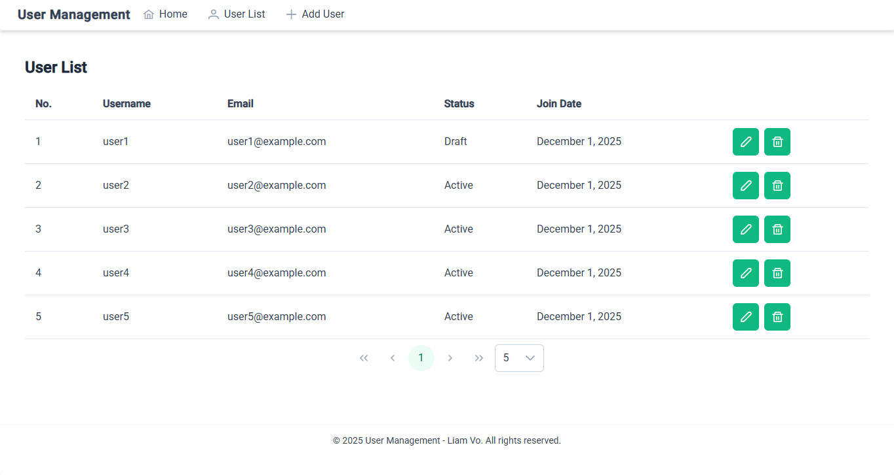
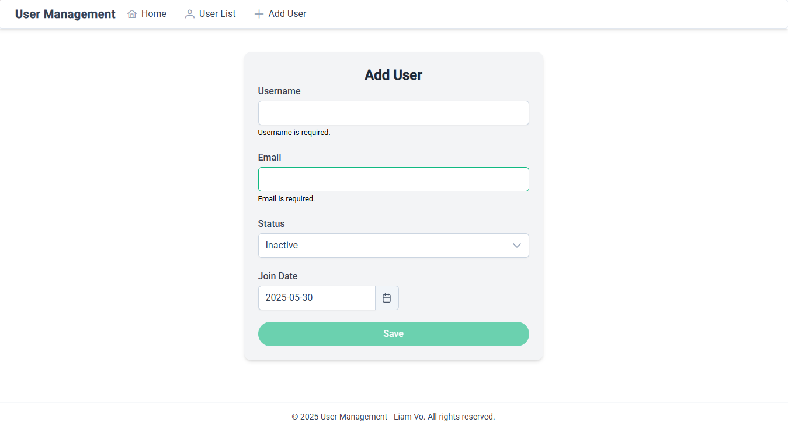
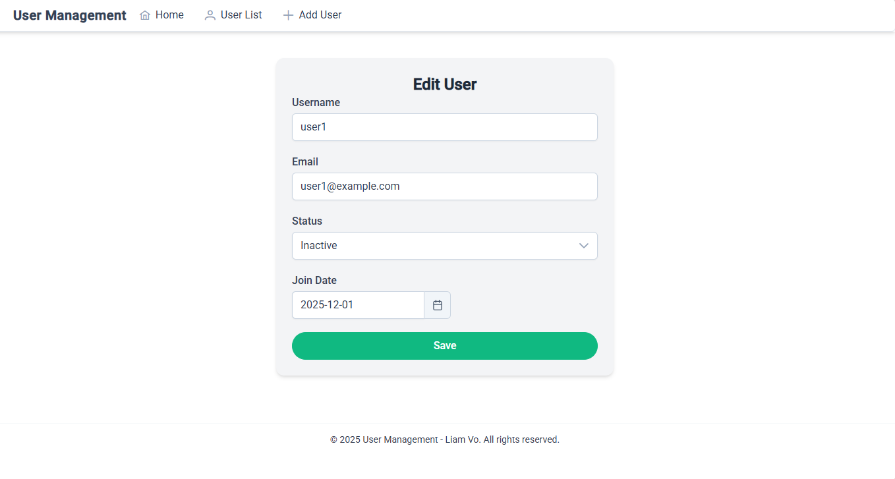
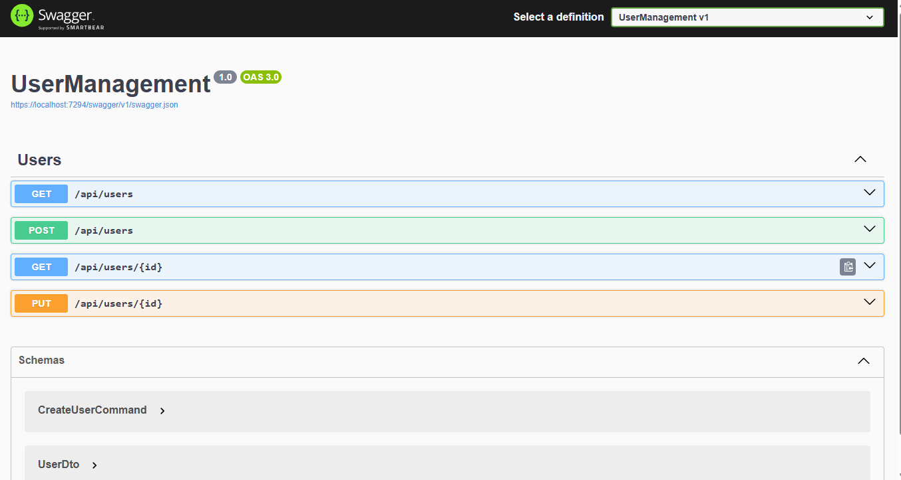
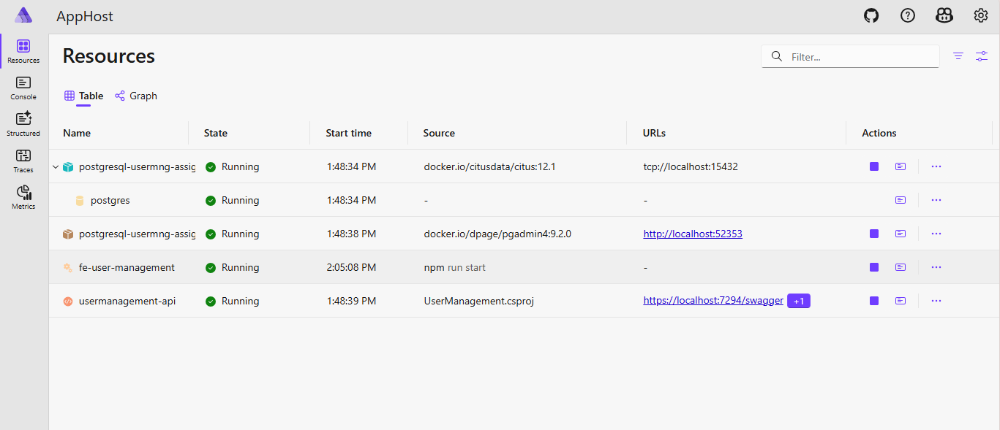

# Aspire Angular Starter

## About

Aspire Angular Starter is a full-stack user management application built with Angular (frontend) and .NET 8 (backend), using PostgreSQL. The app allows you to view, create, and edit users, demonstrating modern web development practices such as standalone components, reactive forms, RESTful API, Swagger, and unit testing.

## Screenshots

**Application UI and main features:**

- User List  
  

- Add User  
  

- Edit User  
  

- API Swagger  
  

- AppHost Dashboard  
  

## Features

- **User List:**  
  Display a paginated table of users with columns: Username, Email, Status, Join Date.
- **Add User:**  
  Create a new user with required fields (username, email). Email format is validated.
- **Edit User:**  
  Edit username and status (Draft/Active) of existing users.
- **Navigation:**  
  Simple navigation bar for switching between features.
- **Backend API:**  
  RESTful API endpoints for user CRUD operations.
- **Validation:**  
  Data validation on both frontend and backend.
- **Database:**  
  Persistent storage with PostgreSQL.
- **Swagger:**  
  API documentation and testing via Swagger UI.
- **Unit Testing:**  
  Sample unit tests for both frontend and backend.

## Tech Stack

### Frontend

- Angular 19 (standalone components, routing, reactive forms)
- PrimeNG UI
- RxJS
- TailwindCSS

### Backend

- .NET 8 Web API
- Entity Framework Core
- PostgreSQL
- MediatR (CQRS)
- FluentValidation
- Swagger (OpenAPI)
- xUnit (unit testing)

## How to Run

1. **Frontend:**  
   Go to `frontend/usermanagement`  
   Run:  
   ```sh
   npm install
   ```

2. **Backend:**  
   Go to `backend/src/AppHost`  
   Run:  
   ```sh
   dotnet run
   ```

3. **Sites:** 
   - AppHost Dashboard: [https://localhost:17094/](https://localhost:17094/)
   - Client Site: [http://localhost:4200](http://localhost:4200)   
   - Api docs: [https://localhost:7294/swagger](https://localhost:7294/swagger)

## API Endpoints

- `GET /api/users?search=&pageIndex=&pageSize=`
- `GET /api/users/{id}`
- `POST /api/users`
- `PUT /api/users/{id}`

---